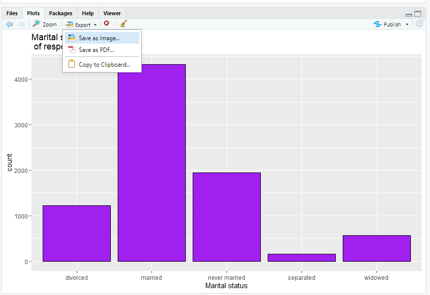

# Graphing and describing variables {#graphing}

## Getting started with this chapter {#getting-started-tidyverse}
To get started in today’s chapter, open the project that you made in lab 1. If you forgot how to do this, see the instructions in section \@ref(exploring).

We are going to install three new packages to use today. One is called "epiDisplay" and the other is called "Hmisc." Enter these two commands into your Console one by one:
```
install.packages("epiDisplay")
install.packages("scales")
```
```{r, echo=FALSE}
library(epiDisplay)
library(scales)
```
Now, open a new script file and save it in your scripts folder as "chapter 3 practice." Copy and paste this onto the page (updating the text so that it is about you):
```
####################################
# Your name
# 20093 Chapter 3, Practice exercises
# Date started : Date last modified
####################################

#libraries------------------------------------------
library(tidyverse)
library(epiDisplay) #the tab1 command helps us make nice frequency tables
library(scales)        #this helps us to put more readable scales on our graphs

Now select all the text on this page, run it, and then save it. 
```
## Getting started with ggplot and graphing {#start-graphing}
R has some nice graphic abilities built in, but the ggplot2 package that comes with the tidyverse is even more powerful. In this lab, we will learn to make bar graphs of nominal and ordinal variables and histograms of interval variables.

**NOTE: You can find templates to reproduce all of the graphs from this workbook in the script file "20093 ggplot2 templates" which is among files that you should have downloaded in section \@ref(class-project), step 7. If you can't find it, you can download it <a href="https://www.dropbox.com/sh/5lqedowui2cnb7x/AABqUP1C2K2bIGef2VyMQOHwa?dl=0">here</a>. Download it and save it to your R Scripts folder for future use.**

### Bar graphing a nominal variable {#bar-graph-nominal}

A nominal variable is a variable where the distance between the values does not give us any information, and the possible values can be listed in any order without confusing us. R does not have a single way to represent nominal variables, but on the three datasets that I have uploaded for this book I have classified the nominal variables as character variables. R sometimes abbreviates this <chr>. If you type this into the console:
```
glimpse(anes2020)
```
you can see that several of the variables in the ANES dataset are classified as characters, including "marital," "military", and "lgbtq".

If you ever want to know how R has classified a variable, you can us the class() command. For example, if you type 
```
class(anes2020$marital) 
```
you can see that R calls the "marital" variable a character variable.

Bar graphs give us a sense of how the cases that we studied are distributed across possible values for a nominal variable. To generate a bar graph using ggplot, you begin with the command ggplot(), and then the first thing you type into the parenthesis is the name of the dataframe that you will be working with. The ggplot package is similar to the dplyr package that uses the pipe (%>%) to mean "and then", but instead of a pipe ggplot uses a plus sign. This code will generate a bar graph of that marital variable (if you enter and run the code, you will see the graph that follows it):

```{r}
ggplot(anes2020, aes(x=marital))+
  geom_bar(fill = "purple", colour = "black")+
  ggtitle("Marital status of respondents")+
xlab("Marital status")
```

The NA bar represents the number of cases where there is missing data for this question. Often you will not want to include that bar in your graph. To get rid of it, you can use a pipe when you call the dataset and tell R to filter out the cases where "marital" is NA. Like this:

```
ggplot(anes2020 %>% filter(!is.na(marital), aes(x=marital))+
  geom_bar(fill = "purple", colour = "black")+
  ggtitle("Marital status of respondents")+
xlab("Marital status")
```
If you execute that command, you will see that now the NA bar is missing.

While "Marital status of respondents" is not a very long title, sometimes you will have graphs with longer titles that you want r to put on two or more lines. To tell R to move to a new line, just insert "\\n" where you want the line break to go, like this:
```{r}
ggplot(anes2020 %>% filter(!is.na(marital)), aes(x=marital))+
  geom_bar(fill = "purple", colour = "black")+
  ggtitle("Marital status\nof respondents")+
xlab("Marital status")
```

### Saving a graph
To save a graph, you can click the export plot menu right above it:
```{r saving, echo = FALSE, out.width='60%'}

```

You can either save it as an image, which you will later be able to import into word or other software, or you can copy it to clipboard and immediately paste it into another piece of software. Either of those work.

### Bar graphing an ordinal variable {#bar-graph-ordinal}
An ordinal variable is a variable where the distance between the values does not give us any information, but the possible values must be listed in a particular order to make sense. R is most willing to treat a variable as ordinal when it is listed as an ordered factor, which R sometimes abbreviates as <ord>. If you type this into the console:
```
glimpse(anes2020)
```
you can see that several of the variables in the ANES dataset are classified as ordered factors, including "edu", "partyid", and "religimp"

Reminder: if you ever want to know how R has classified a variable, you can use the class() command. For example, if you type this: 
```{r}
class(anes2020$edu) 
```
you can see from the output R calls the "edu" variable "ordered" "factor".

"Partisanship" is often measured in an ordinal way, including on the anes2020 dataframe. To generate a bar graph of the partyid variable (an ordinal measure of partisanship), we can use this code:
```{r}
ggplot(anes2020 %>% filter(!is.na(partyid)), aes(x=partyid))+
  geom_bar(fill = "purple", colour = "black")+
  ggtitle("Strength of party identification of respondents")+
  xlab("Party")
```

### What to do about overlapping labels
If you look at the previous graph, you might notice that the labels at the bottom overlap. This makes it hard to read! To deal with overlapping labels like this, you can add this line to your code (please note that R will not understand this code if you did not install the scales package in section \@ref(getting-started-tidyverse) and then run the command "library(scales)"):
```
scale_x_discrete(guide = guide_axis(n.dodge=2))+
```
This is how our new code looks:
```{r}
ggplot(anes2020 %>% filter(!is.na(partyid)), aes(x=partyid))+
  geom_bar(fill = "purple", colour = "black")+
  ggtitle("Strength of party identification of respondents")+
  scale_x_discrete(guide = guide_axis(n.dodge=2))+
xlab("Party")
```

### Generating a histogram {#histogram}
An interval variable is a variable where the distance between the values gives us useful information and where the possible values must be listed in a particular order to make sense.. In this class, it is generally safe to assume that a variable that is neither an ordered factor nor a character variable is interval. *However, variables with only two values (such as 0 and 1) should not be treated as interval.*

You can, in theory, make a bar graph of an interval variable. However, since there are so many values to most interval variables, those bar graphs become very difficult to read. Instead, we often generate histograms of interval variables.  Histograms are bar graphs where each bar represents a range of values of the variable of interest instead of a single bar. For example, here is how we can make a histogram of the population variable in our world dataset:
```{r, warning=FALSE, message=FALSE}
ggplot(world, aes(x = UNDP_pop)) +
  geom_histogram(fill = "purple", colour = "black")+
  ggtitle("Histogram of countries' populations")+
  xlab("population")
```

### Removing scientific notation from axes
The above graph is ok, but because the population numbers are so big, R has converted them to scientific notation. To force R not to do this, we can use a command made possible by the scales package that we installed in section \@ref(getting-started-tidyverse):
```
scale_x_continuous(labels = label_comma())
```
Combined with the rest of our code, we can generate the graph like this:
```{r, warning=FALSE, message=FALSE}
ggplot(world, aes(x = UNDP_pop)) +
  geom_histogram(fill = "purple", colour = "black")+
  scale_x_continuous(labels = label_comma())+       #gets rid of scientific notation
  ggtitle("Histogram of countries' populations")+
  xlab("population")
```

### Adjusting bin width on a histogram
The bars on a histogram are called "bins." Looking at this graph, we can see that R has chosen to set the bins at around 50,000,000. What if we wanted to make the bins narrower? We can set the bin width like this:

```{r, warning=FALSE, message=FALSE}
ggplot(world, aes(x = UNDP_pop)) +
  geom_histogram(binwidth=10000000, fill = "purple", colour = "black")+
  scale_x_continuous(labels = label_comma())+
  ggtitle("Histogram of countries' populations")+
xlab("population")
```

Those narrower bins let us see more of the variation in the variable – we can see that the biggest group of countries, by far, has a population of 10,000,000 or less.

## Central tendancy and dispersion
With all variables, it is helpful to both you and your readers to make observations about their central tendency—what a typical case looks like, and dispersion—how the actual values are spread out across possible cases. 

### Central tendency and dispersion of nominal variables
With nominal variables, there are two useful techniques to help us discuss central tendancy and dispersion. One is covered above, in section \@ref(bar-graph-nominal): you can make a bar graph. Second, you can also make a frequency table. To make a frequency table, you can use the table() command to produce a simple one in base R, but the tab1 command that is available through the epiDisplay library that we installed in section \@ref(getting-started-tidyverse) is more flexible. So, let’s try to look at the region variable from the states2010 dataset. Enter the following into today’s practice R script file, and run it:

```{r}
#make a frequency table and bar graph of the region variable in states2010
tab1(states2010$region, cum.percent=FALSE)
```
You can see that this command generates two sets of output: a graph that you can see if you click the "plots" tab in the bottom right, and some information in the Console. 

The graph is ok, but the graphs that we generated above are nicer, so we will use those instead.

The information in the Console tells you that there are 12 states in the dataframe that are classified as being in the midwest, 9 that are classified as being in the northeast, 17 in the south, and 13 in the west. The next column to the right tells you what percent of states are in each category.

There is only one meaningful way to measure the central tendency of a nominal variable: the mode. However, R does not have a direct way of measuring the mode. In this case, that is not a problem, as there are only four possible regions in the dataset, and you can clearly see that the largest number of states are in the south. However, sometimes there will be a lot more values than this! In that kind of situation, you can add the qualifier sort.group="decreasing" to the tab1 command, like this:
```{r}
#make a frequency table and bar graph of the region variable in states2010
#adding sort.group="decreasing" to list the values in reverse order of frequency
#this is useful for finding the mode
tab1(states2010$region, cum.percent=FALSE, sort.group="decreasing")
```
You can see from this output that the mode has come to the top. So, between the bar graph and the frequency table, we can observe that the modal state is in the South. 17, or 33.3% of states, are in that region. That is the central tendency of our region variable.

Regarding the dispersion of this variable, we can note that no region has a majority of states, and the states seem to be reasonably evenly distributed across regions, with 33.3% of states in the modal region (the south) and 17.6% of states in the least common region (the northeast).

### Central tendency and dispersion of ordinal variables
With ordinal variables, we can use the same techniques that we use for nominal variables but with one exception: since the order of the possible values does give us important information for ordinal variables, the cumulative percent also gives us useful information. Thus, we can ask R to report the cumulative percent too. Let’s try it with the results of the question "how important is religion to you?" that was asked in the 2020 ANES survey. We can use this command (notice how we are now writing cum.percent=TRUE because we are dealing with an ordinal variable):
```{r}
tab1(anes2020$religimp, cum.percent=TRUE)
```
R is giving us a lot of information here! 

The first column on the left is the possible values, ranging from "extremely important" to "not important at all." There are also some NAs – cases for which we do not have data on this question. 

The second column is how frequently each answer is given. Looking at that column, we can already tell that the modal value is "extremely important"; 2277 of the 8280 people surveyed answered that religion is extremely important to them. 

The third column is the percent of cases with each value, including the NAs for which we have no information. 

The fourth column is the cumulative percent including NAs. This is the percentage of cases that got the value of interest or a lower value. So, 27.5% answered "extremely important," 46.6% answered "extremely important" or "very important", 65.9% answered "extremely important", "very important"," "moderately important", etc.  

The fifth and sixth column repeat the third and fourth column, but they exclude the NAs. **In general, you should use the columns that exclude NAs when interpreting your data.**

Regarding the central tendency of this variable, we can again ask R to calculate the mode like we did with our nominal variable, but since this is an ordinal variable, we can also ask R to calculate the median. 

To calculate the mode, we can add the "sort group: decreasing" qualifier that we used in section 3.3, and the mode will rise to the top.

```{r}
tab1(anes2020$religimp, cum.percent=TRUE, sort.group = "decreasing")
```
Our output tells us what we already know – the "extremely important" group is the largest, but it is not the majority.

R has a median() command that we will be able to use with interval data. However, unfortunately we can’t use it with ordinal data. **There is a nice trick to finding the median of an ordinal variable, though.** Take a look at those cumulative percents in the output that we generated without the sort.group= "decreasing" qualifier. Focus on the column with NAs excluded – the right-most column. The first value for which the cumulative percent is 50 or higher is the median value of that variable. So, we can say that the median person in our sample says that religion is "moderately important" to them.

So, now we can make two observations about the central tendency of our religion variable – the mode is "extremely important" and the median is "moderately important." 

What can we say about the dispersion? To discuss the dispersion it is helpful to generate a bar graph. We ca look at the one automatically generated by tab1, but I prefer the look of the ones that we generate with ggplot. So, we can use the same code from section \@ref(bar-graph-ordinal) to generate a bar graph of this variable (Note that we make the x-axis table disappear with "NULL" because the graph title already explained what the x-axis means):
```{r}
ggplot(anes2020 %>% filter(!is.na(religimp)), aes(x=religimp))+
  geom_bar(fill = "purple", colour = "black")+
  ggtitle("How important is religion to ANES respondents in 2020?")+
xlab(NULL)
```

What can we say about the dispersion of this variable? Well, based on the frequency table we can note that there is no value where the majority of cases lie – the cases are reasonably well spread out across possible values, ranging from 27.6 percent at "extremely important" to 12.9 percent at "a little important."

We can also note that the distribution of this variable is u-shaped: the two highest values are "extremely important" and "not important at all."

### Central tendancy and dispersion of interval variables
When we look at interval variables, we can use the mean, median, and mode to discuss the central tendency. R makes it easy to calculate the mean and median, with the command summary() that we learned in section \@ref(exploring) (you can also use the commands mean() and median() with the same result). So, for example, let’s look at the variable x_tax_burden in the states2010 dataset. This is a state’s per capita taxes divided by that state’s per capita income. In other words, it tells us the proportion of their income that the average citizen pays in state taxes in each state. We can use the summary command:
```{r}
summary(states2010$x_tax_burden)
```
Here, we see that the mean and median, .09465 and .094, are quite close to each other. This is generally a sign that the variable is not skewed. How about the mode? To generate the mode, we can use the same command that we used for nominal and ordinal variables:
```
tab1(states2010$x_tax_burden, sort.group = "decreasing")
```
If you enter that command into the Console, you will see a lot of output, but if you scroll to the top you will see that the most common value for the x_tax_burden variable, the mode, is .093; it occurs 5 times.

Now we have three measures of the central tendency of our x_tax_burden variable: the mean is 09465, the median is .094, and the mode is .093.

How about the dispersion? With interval variables, we can use a number of strategies to represent the dispersion. We can have R calculate the standard deviation and the interquartile range (the 3rd quartile minus the 1st quartile), and we can generate a histogram. To generate the standard deviation, we can use sd(), and to generate the interquartile range, we can use IQR(): 
```{r}
sd(states2010$x_tax_burden)
IQR(states2010$x_tax_burden)
```

We can also use the code from section \@ref(histogram) to visually display the central tendancy of our variable, like this:
```{r}
ggplot(states2010, aes(x = x_tax_burden)) +
  geom_histogram(fill = "purple", colour = "black")+
  ggtitle("Histogram of US states' tax burden, 2010")+
xlab(NULL)
```

This histogram shows us that this variable is relatively bell-shaped with no outliers that really stand out.

### Standard deviation and IQR when you have NAs
One issue with the sd and IQR commands is that if there is one case in the dataframe that you are looking at with missing data (i.e. coded as na), then R will give "NA" as the output. You can see this if you type:
```{r}
sd(anes2020$age)
```

To address this, just add ",na.rm=TRUE" after the variable with the NAs, like this:
```{r}
sd(anes2020$age, na.rm=TRUE)
```
That just tells R to ignore the NAs when calculating the standard deviation (and you can do the same thing with the interquartile range). 

## A note on using the states2010 and world dataframes {#states-world}
When looking at the states2010 and world dataset, there are times when we might want to know which values of a variable come from which states or countries. When we want to know this, the select and arrange commands from the tidyverse can be helpful. For example, this code can help us learn about which states have which tax burdens:
```
states2010 %>% 
  select(state, x_tax_burden) %>% #focusing in on a few variables
  arrange(x_tax_burden) #sorting this variable from smallest to largest
				#to sort from largest to smallest, you would write
				#arrange(desc(x_tax_burden))
```
When you execute this code, what do you learn about the states with the largest and smallest tax burdens?

## Review of this chapter's commands
```{r, echo=FALSE}
r1<-c("class()","Tells us how a specific vector is categorized. Is it a character vector, an ordered factor, etc.?","Base R")
r2<-c("ggplot()","Begins a ggplot graphic. Feel free to refer to the \"20093 ggplot2 templates\" script file to find templates for all graphs you will make using this workbook",	"ggplot2 (tidyverse)")
r3<-c("mean()","Calculates the mean of a variable.","Base R")
r4<-c("median()","Calculates the median of a variable.","Base R")
r5<-c("sd()","Calculates the standard deviation of a variable. Use na.rm=TRUE if there is some missing data, like this: sd(dataframe\\$variable, na.rm=TRUE).","Base R")
r6<-c("IQR()","Calculates the interquartile range of a variable. Use na.rm=TRUE if there is some missing data, like this: IQR(dataframe\\$variable, na.rm=TRUE).","Base R")
df<-rbind(r1,r2,r3,r4,r5,r6)
colnames(df)<-c("Command","Purpose","Library")
df<-as.data.frame(df)
rownames(df)<-NULL
knitr::kable(df, row.names=NA)
rm(r1,r2,r3,r4,r5,r6,df)
```

## Review exercises
Let’s practice some of the things that we learned in this chapter. 

1. Create a new R script called "Chapter 3 Exercises," and save it to your R scripts folder. Make a header for the script based on the description from section \@ref(org-script). Use the library() command to load the tidyverse, epiDisplay, and scales.
2. Choose a nominal variable from either anes2020, states2010, or world. Generate an appropriate graph and calculate the relevant statistics to make observations about this variable’s central tendency and dispersion. Create a new file in your word processor, and paste your graph in. Also list all relevant statistics to help you make observations about this variable’s central tendency and dispersion.
3.	Make some observations about the variable from \#2’s central tendency and dispersion. Is there anything that surprises you about it? What?
4.	Choose an ordinal variable from either anes2020, states2010, or world. Generate an appropriate graph and calculate the relevant statistics to make observations about this variable’s central tendency and dispersion. Paste your graph into the word processor file that you generated for \#2. Also list all relevant statistics to help you make observations about this variable’s central tendency and dispersion.
5.	Make some observations about the variable from \#4’s central tendency and dispersion. Is there anything that surprises you about it? What?
6.	Choose an interval variable from either states2010 or world. Generate an appropriate graph and calculate the relevant statistics to make observations about this variable’s central tendency and dispersion. Paste your graph into the word processor file that you generated for \#2. Also list all relevant statistics to help you make observations about this variable’s central tendency and dispersion.
7.	Discuss the countries or states that have the highest and lowest values on your variable of interest (see the note at the bottom of section \@ref(states-world) for help with this). Are there any countries or states that surprise you on this list? 
8.	Make some observations about the variable from \#6’s central tendency and dispersion. Is there anything that surprises you about it? What?
