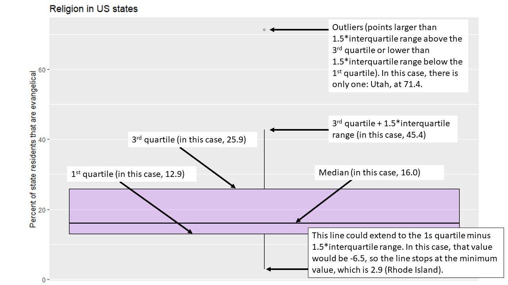

# Making controlled comparisons

## Getting started with this chapter {#getting-started-comparisons}
To get started in today’s chapter, open the project that you made in lab 1. If you forgot how to do this, see the instructions in section \@ref(exploring).

Now, open a new script file and save it in your scripts folder as "chapter 5 practice." Copy and paste this onto the page (updating the text so that it is about you):
```
####################################
# Your name
# 20093 Chapter 5, Practice exercises
# Date started : Date last modified
####################################

#libraries------------------------------------------
library(tidyverse)
library(Hmisc)      #the cut2 command helps us simplify interval variables
library(scales)	    #this is useful when the labels on our axes overlap
library(tigerstats)	#colPerc can also be useful with crosstabs 
```
Now select all the text on this page, run it, and save it.

## Representing crosstabs with stacked bar graphs {#stacked}

In chapter \@ref(recoding) we learned how to generate crosstabs (and, crucially for interpretation, crosstabs with percents in columns). Crosstabs themselves have a lot of numbers on them, and can thus be difficult to interpret on their own. Many social scientists address this problem by generating graphs. A "stacked bar graph" is a really nice tool for visually depicting relationships in a bar graph. The code to generate stacked bar graphs is a little bit long and complex, so just feel free to copy and paste the below or the code from the "20093 ggplot2 templates" file that you should ahve downloaded in section \@ref(class-project), step 7. Let’s return to the relationship that we were looking at in section \@ref(cross-tabs), between education (our independent variable) and income (our dependent variable).

Here is the code:

```{r}
#first, generate a dataframe called "plotting.data" based on grouped variables from #anes2020
plotting.data<-anes2020 %>%
  filter(!is.na(edu)&!is.na(income)) %>% 
  group_by(edu, income) %>% 
  summarise(n=n()) %>% 
  mutate(freq = n / sum(n))

#second, make the graph
ggplot(plotting.data, aes(x = edu, y = freq, fill=income)) +
  geom_col(position = "fill") +
  scale_y_continuous(labels=percent)+
  scale_x_discrete(guide = guide_axis(n.dodge=2))+ #this line is in here because
#without it the x-axis labels #overlap. You can remove it if #that isn’t a problem 
  scale_fill_viridis_d(name="income")+ #this color palate is made to be readable for #colorblind people
  ggtitle("Education and income in the 2020 ANES")+
  xlab("Education")+
  ylab(NULL)
```

One thing to note in this code: it begins by creating a new dataframe called "plotting.data." When you run it, that dataframe will show up in your RStudio environment. If you run it again with new variables, the new "plotting data" that you make will overwrite the old one. 

If it bothers you having that "plotting.data" object in your environment, you can always remove it with the command 
```
rm(plotting.data).
```
Another thing to note: the "scale_fill_viridis_d()+" line of code asks R to use a color palette that is easy to read for people that are colorblind. There are many, many choices of color palette in R, and you are welcome to play around with colors, but it is also fine to just stick to this palette. If you’d rather have a black and white graph, there is code for that in the "20093 ggplot2 templates" file.

Looking at the graph, we can see that our X-axis is our independent variable, education, and our Y-axis is the column percentages of our dependent variable, income. Focusing on the yellow region, we can clearly see that each increase in education seems to correspond to an increase in the percent of people in the highest income earning category (with the possible exception of the movement between some college and associate degree). Focusing on the dark blue region, we can clearly see that, as level of education increases, the percent of people in the lowest income category decreases. In short, this graph has all of the same information that we got when looking at the crosstab that we generated with:
```
colPerc(xtabs(~income+edu, data=anes2020))
```
from our previous lab, but it is much easier to take in a bunch of that information at the same time.

## Representing mean comparison tables with boxplots
In addition to the histogram that we introduced in chapter 3, another useful way of representing the distribution of a single interval variable is with a boxplot. Here is the code for a boxplot of the variable (you can also find this code in the "20093 ggplot2 templates" file):
```{r}
#make a boxplot of evangelicals
ggplot(states2010, aes(y = evangelical_pop)) +
  geom_boxplot(color="black", fill="purple", alpha=0.2)+
  scale_x_continuous(breaks = NULL) +
  ggtitle("Religion in US states")+
  xlab(NULL)+
  ylab("Percent of state residents that are evangelical")
```

A boxplot gives us some interesting information about an interval variable. The bottom of the box is the 1st quartile (25% of cases have that value or lower) and the top of the box represents the 3rd quartile (75% of cases have that value or lower). The horizontal line represents the median value, and the vertical lines coming out of the box extend to the first quartile minus 1.5 multiplied by the interquartile range and the third quartile plus 1.5 multiplied by the interquartile range. Cases above and below this line are outliers, and are identified by points on the graph. The one outlier in this graph is Utah, which I figured out using this code:
```
states2010 %>% 
  select(state, evangelical_pop) %>% 
  arrange(desc(evangelical_pop))
```
Here is a labeled version of a boxplot for your reference:
```{r boxplot, echo = FALSE, out.width='90%'}

```

So, in other words, we can learn a lot about a variable from a single graph! 

Boxplots are also a useful way to look at the properties of an interval variable across several values of a nominal or ordinal variable, which is what we were doing with our mean comparison table in chapter \@ref(recoding). Let’s take a graphical look at the relationship between the region that a state is in and the percent of evangelicals that live in that state. We can set up that kind of graph with the following code:
```{r}
#make boxplots of regions and evangelicals
ggplot(states2010, aes(x = region, y = evangelical_pop)) +
  geom_boxplot(color="black", fill="purple", alpha=0.2)+
  ggtitle("Region and religion in US states")+
  xlab("Region")+
  ylab("Percent of state residents that are evangelical")
```

This graph shows us a lot of cool things. We can see that the states with the smallest percentages of evangelicals in the South appear to have roughly the same percent as the highest outlier in the Northeast. We can also see that, despite the existence of an extreme outlier (which we learned above is Utah), the states in the West still seems to have a smaller percent of evangelicals than states in the South. 

## Adding a control to a crosstab
So far, we have learned to look at the relationship between pairs of variables. However, in real social scientific analysis we will often be interested in more than that. We will be interested in other factors that could be the true cause of variation in our dependent variable. In other words, we often want to know whether the correlation that we observe is **spurious**. If the relationship between the independent and dependent variable is the same at different values of a control, we call the relationship between the independent and dependent variables, controlling for the third, **additive**. If the relationship between the independent and dependent variables is different at different values of a control, we call that relationship an **interaction**.

Let’s return to the relationship that we looked at earlier, between education and income. Here is the crosstab that we generated in chapter \@ref(recoding):
```{r, echo=FALSE}
colPerc(xtabs(~income+edu, data=anes2020))
```
Let’s look at the row representing the people who make $110,000 or more per year. As we move from the lowest level of education to the highest, we can see that the percent of people in the highest income category moves from 6.4% to 43.84%. We can actually subtract 6.4 from 43.84 to say that the effect size is roughly 37.44%. In other words, 37.44% more people with the highest degree of education are in the highest income category than are people in the lowest education category.  
Do we think that this result would be roughly the same for men and women? To answer this question, we can use a neat tool that we have actually played with a bit in previous chapters: the "filter" command that is a part of the dplyr package (and thus works with pipes). The ANES dataset has a variable called sex, where 0 means "men" and 1 means "women." Let’s have R make that crosstab again, but only for men, and then again, but only for women. To do that, we can use this code:
```{r}
#men only
colPerc(xtabs(~income+edu, data=anes2020 %>% filter(sex==0)))
```
**A quick note**: if we wanted to use filter with a variable whose values are defined by text, such as our income variable, we must put the text in quotation marks. Here, we do not have to use quotation marks because sex is defined numerically.

If we do the same comparison that we did above, we can see that as men more from the lowest to the highest education category, the percent in the highest income category increases from 8.33% to 48.42%. The total effect size is about 40.09%, which is a few percent higher than the 37.44% overall effect size that we witnessed above. Now let’s look at women only:
```{r}
#women only
colPerc(xtabs(~income+edu, data=anes2020 %>% filter(sex==1)))
```
Applying the same analysis that we did above, we can see that as women’s education level increases from the lowest to the highest level, the percent of people in the highest income bracket moves from 4.55% to 40.32%; a total effect size of 35.77% (compared with 40.09 for men). In other words, this data suggests that both men and women are economically rewarded for more education, but that men seem to be rewarded a bit more. If we were to write up these results, at this point we would have to use our own judgment to decide whether the effect size differs enough to call the relationship between education and income controlling for gender an interaction, or whether it makes more sense to call it additive. We can use more advanced statistical tools to make that determination with more rigor, but for now, we will rely on our judgment.

There is not a single tool to graph relationships between three ordinal or nominal variables in an easy to interpret way. Instead, we can use the filter%>% command from above to make two graphs, and then use insert table in our word processor to nearly display them side by side.

Here is the code for the graph for only men (with the line "filter(sex==0) %>% #filtering so that we only look at men" added):
```{r}
plotting.data<-anes2020 %>%
  filter(!is.na(income)&!is.na(edu)) %>% 
  filter(sex==0) %>% #filtering so that we only look at men
  group_by(edu, income) %>% 
  summarise(n=n()) %>% 
  mutate(freq = n / sum(n))
ggplot(plotting.data, aes(x = edu, y = freq, fill=income)) +
  geom_col(position = "fill") +
  scale_y_continuous(labels=percent)+
  scale_x_discrete(guide = guide_axis(n.dodge=2))+
  scale_fill_viridis_d()+
  ggtitle("Education and income for men in the 2020 ANES")+
  xlab("Education")+
  ylab(NULL)
```

And here is the code for the graph for only women:
```{r}
plotting.data<-anes2020 %>%
  filter(!is.na(income)&!is.na(edu)) %>% 
  filter(sex==1) %>% #filtering so that we only look at women
  group_by(edu, income) %>% 
  summarise(n=n()) %>% 
  mutate(freq = n / sum(n))
ggplot(plotting.data, aes(x = edu, y = freq, fill=income)) +
  geom_col(position = "fill") +
  scale_y_continuous(labels=percent)+
  scale_x_discrete(guide = guide_axis(n.dodge=2))+
  scale_fill_viridis_d()+
  ggtitle("Education and income for men in the 2020 ANES")+
  xlab("Education")+
  ylab(NULL)
```

## Adding a control to a mean comparison table
The ANES survey has a number of "feeling thermometer" questions, where respondents were asked how warmly or coldly they felt toward institutions, individuals, and groups of people. These questions all range from 0 (meaning that the respondent feel very negatively toward the subject), to 100 (meaning that the respondent feels very positively about the subject). 

For this section, I am going to treat the feeling thermometer about Donald Trump as my dependent variable. For my independent variable, I am going to look at a question that respondents were asked about how outraged they feel about how things are going in the country these days, which is coded as "outrage" in the anes2020 dataframe. My hypothesis will be this: when comparing individuals, those that were outraged about how things are going will be more likely to feel negatively about Donald Trump than will those who were not outraged about how things are going.

If you run```table(anes2020$outrage)```, you will see that the variable is coded ordinally with five values ranging from "not at all" to "extremely." Before running the analysis, I am going to simplify this variable so that we are comparing people who are "very" or "extremely" outraged with everyone else. I am going to call my new variable "outrage2." Here is the code that I will use to simplify this variable:
```{r}
anes2020<-anes2020 %>% 
  mutate(outrage2=recode(outrage, 'very'="outraged", 'extremely'="outraged",
                         .default="not outraged"))
```
Notice how this code uses the .default qualifier rather than typing out the three other possible values that I wanted to recode into "not outraged." That is a nice shortcut.

Now, let’s make a mean comparison table to see how the mean Donald Trump feeling thermometer score differs between outraged and non-outraged people:
```{r}
anes2020 %>% 
  filter(!is.na(ft_trump)&!is.na(outrage2)) %>% 
  group_by(outrage2) %>% 
  summarise(mean=mean(ft_trump), sd=sd(ft_trump), n=n())
```
This suggests that our hypothesis is true. People who were outraged in 2020 gave President Trump an average score of 28.4 on a feeling thermometer, while people who were not outraged gave President Trump an average score of 56.6 on a feeling thermometer: a difference of 28.4. That seems like a pretty substantial difference!

To graph this relationship, we can use this code:
```{r}
ggplot(anes2020 %>% filter(!is.na(outrage2)), aes(x = outrage2, y = ft_trump)) +
  geom_boxplot(color="black", fill="purple", alpha=0.2)+
  ggtitle("ANES 2020, Feelings about President Trump by level of outrage")+
  xlab("Is R outraged?")+
  ylab("Feelings about President Trump\n(100 is warm and 0 is cold)")
```

This graph shows us that the feeling thermometer scores for President Trump seem to have ranged from 0 to 100 for both outraged and non-outraged respondents. However, the median score for outraged respondents was a 0, while the median score for not outraged respondents was a 65, which is just below the 3rd quartile of outraged respondents (which was a 70). 

When doing this analysis, I suspected that what is really going on had to do with partisanship. Maybe democrats were more likely to be outraged than Republicans since the president was a Republican. To test this hypothesis, I took a look at my partyid variable, and I saw that it had seven values ranging from "strong democrat" to "strong republican." I would like to simplify this variable to make it a bit easier to interpret these results, so I do so with the following code (notice how I save myself some typing with the .default qualifier):
```{r}
anes2020<-anes2020 %>% 
  mutate(partyid3=recode(partyid, 'strong democrat'="democrat", 
                         'not very strong democrat'="democrat",
                         'independent democrat'="democrat",
                         'independent'="independent",
                         .default="republican"))
```
Now let’s add our control variable to our mean comparison table. It is easier to add a control variable into a mean comparison table than it was to add a control variable into our cross tab. To do so, we can use the following code:
```{r}
anes2020 %>% 
  #first I filter out the NAs for all 3 variables
  filter(!is.na(ft_trump)&!is.na(partyid3)&!is.na(outrage2)) %>%
  #then I group by the control first, and then the IV
  group_by(partyid3, outrage2) %>% 
  #then I summarise in the same way that I do with a two-variable table
  summarise(mean=mean(ft_trump), sd=sd(ft_trump), n=n())
```

The comments explain what is happening in the code. It is almost the same as the code for a two variable mean comparison table, but I group by the control (first) and then the independent variable, rather than just grouping by the independent variable, as I did in the two-variable code.

Let’s look at this output. First, focus on the first two rows. They tell us that Democrats who were outraged in 2020 felt about 16.24 points more coldly toward President Trump than Democrats who were not outraged (because 20.8-4.56=16.24). For independents, the effect of outrage was even larger. Independents who were outraged felt 21.2 points more coldly toward President Trump than independents who were not outraged (because 45.7-24.5=21.2). For Republicans, there seemed to be very little relationship at all between outraged and feeling about President Trump. In fact, people who were outraged felt -0.5 points more coldly toward President Trump because 76.8-77.3=-0.5). Or, put another way, outraged Republicans felt 0.5 points more **warmly** toward President Trump than did non-outraged Republicans.

In other words, the relationship between outrage in 2020 and feelings about President Trump is very different at different levels of partisanship. We thus call this an **interactive relationship**. 

To graphically represent this relationship, we can use this code (which you can also find in the "20093 ggplot2 templates" file):
```{r}
ggplot(anes2020 %>% filter(!is.na(partyid3) & (!is.na(outrage2))), 
       aes(x = partyid3, y = ft_trump, fill=outrage2)) +
  geom_boxplot()+
  ggtitle("ANES 2020, Feelings about President Trump by PartyID and Outrage")+
  xlab("Party ID")+
  ylab("Feelings about President Trump\n(100 is warm and 0 is cold)")+
  scale_fill_discrete(name = "Level of outrage")
```

This boxplot clearly shows how the relationship between outrage and feelings about President Trump was different for Democrats and independents than it was for Republicans. This is a really nice example of an interaction, and it suggests that "outrage" may have had different meanings for Democrats, independents, and Republicans.

## Review of this chapter's commands
```{r, echo=FALSE}
r1<-c("Filter(VARIABLE==VALUE) %>%","A way to filter out cases that you are not interested in. If the value you are interested in is coded as text (as is the case with our nominal and ordinal variables), be sure to put it in quotation marks.", "dplyr (tidyverse)")
r1<-t(r1)
df<-as.data.frame(r1)
colnames(df)<-c("Command","Purpose","Library")
rownames(df)<-NULL
knitr::kable(df, row.names=NA)
rm(r1,df)
```

## Review exercises

Let’s practice some of the things that we learned in this chapter. 

1. Create a new R script called "Chapter 5 Exercises," and save it to your R scripts folder. Make a header for the script based on the description from section \@ref(org-script). Use the library() command to load the tidyverse, Hmisc, tigerstats, and scales libraries.
2. Choose a variable from either anes2020, states2010, or world that you are interested in thinking about as a dependent variable (don’t choose one of the variables that we used as an example in this chapter). Generate an appropriate graph and calculate the relevant statistics to make observations about this variable’s central tendency and dispersion. Create a new file in your word processor, and paste your graph in. Also list all relevant statistics to help you make observations about this variable’s central tendency and dispersion.
3. Choose a second variable from the same dataframe that you used for question 2 to use as an independent variable (i.e. as a variable that you think might cause variable in your dependent variable). In your word processor file, write a few sentences about what kind of relationship you expect to see between your independent and dependent variables and why. 
4. If the variable that you selected in \#3 is interval, use the cut2() and/or mutate(recode()) commands to make it into an ordinal variable. If the variable that you selected on \#3 is ordinal or nominal, make observations about the variable’s central tendency and dispersion in your word processor file (supported by an appropriate graph and appropriate statistics).
5. Generate a crosstab or a mean comparison table (as appropriate) to examine the relationship between your independent variable from \#3 and your dependent variable from \#2, and also generate the appropriate graph to examine this relationship. Paste your graphics and your crosstab or mean comparison table (in a readable format) into your word processor file. Be sure to format your crosstab or mean comparison table in a way that is easy for the reader to understand (this might involve creating a table).
6. In your word processor document, briefly (in 1-4 sentences) discuss what you conclude about your hypothesis based on the output from \#5.
7. Now choose another variable to use as a control. Using cut2() and/or mutate(recode()), recode this variable so that it has only a few values (two, or three at most).
8. Generate a crosstab or a mean comparison table (as appropriate) to examine the relationship between your control from \#7, your independent variable from \#3 and your dependent variable from \#2, and also generate the appropriate graph to examine this relationship. Paste your graphics and your crosstab or mean comparison table (in a readable format) into your word processor file. Be sure to format your crosstab or mean comparison table in a way that is easy for the reader to understand (this might involve creating a table).
9. In your word processor document, briefly (in 1-4 sentences) discuss what you conclude about your hypothesis based on the output from \#8. Would you say that the relationship between your independent variable and your dependent variable, controlling for your control variable, is additive, interactional, or spurious? Why?
